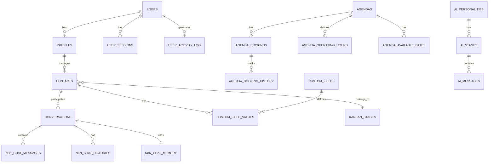

# 📊 Documentação Completa do Banco de Dados - ValoreDash V1-48

## 📋 Índice
1. [Requisitos do Projeto](#1-requisitos-do-projeto)
2. [Entidades e Relacionamentos](#2-entidades-e-relacionamentos)
3. [Tipos de Dados e Restrições](#3-tipos-de-dados-e-restrições)
4. [Estratégia de Indexação](#4-estratégia-de-indexação)
5. [Considerações de Performance](#5-considerações-de-performance)
6. [Considerações para Escalabilidade](#6-considerações-para-escalabilidade)

---

## 1. Requisitos do Projeto

### 🎯 **Objetivo Principal**
O ValoreDash é uma plataforma de CRM e automação de conversas que integra:
- Sistema de chat automatizado via N8N
- Gestão de clientes e leads
- Sistema de agendamento
- Dashboard de métricas e relatórios
- Gestão de usuários e permissões
- Sistema Kanban para pipeline de vendas

### 🛠️ **Stack Tecnológica**
- **Frontend**: React 18 + TypeScript + Vite
- **UI Framework**: shadcn/ui + Tailwind CSS
- **Backend**: Supabase (PostgreSQL)
- **Autenticação**: Supabase Auth
- **Estado**: TanStack Query (React Query)
- **Automação**: N8N para workflows de chat
- **Deploy**: Vercel

### 📊 **Requisitos Funcionais**
1. **Gestão de Contatos/Clientes**
   - CRUD completo de contatos
   - Campos personalizados dinâmicos
   - Histórico de interações
   - Segmentação por estágios (Kanban)

2. **Sistema de Chat**
   - Integração com N8N
   - Histórico de conversas
   - Memória contextual
   - Backup de mensagens

3. **Agendamento**
   - Calendário de disponibilidade
   - Agendamentos recorrentes
   - Notificações e lembretes
   - Histórico de alterações

4. **Métricas e Relatórios**
   - Dashboard em tempo real
   - Métricas de conversão
   - Relatórios personalizados
   - Análise de funil de vendas

5. **Gestão de Usuários**
   - Controle de acesso (admin/user)
   - Log de atividades
   - Configurações personalizadas

### 🔒 **Requisitos Não-Funcionais**
- **Performance**: Resposta < 200ms para consultas básicas
- **Escalabilidade**: Suporte a 10k+ contatos simultâneos
- **Disponibilidade**: 99.9% uptime
- **Segurança**: RLS (Row Level Security) no Supabase
- **Backup**: Backup automático diário

---

## 2. Entidades e Relacionamentos

### 🏗️ **Diagrama de Entidades Principais**



### 📊 **Principais Entidades**

#### **👥 Sistema de Usuários**
- **users** (Supabase Auth): Autenticação base
- **profiles**: Perfis estendidos dos usuários
- **user_settings**: Configurações personalizadas
- **user_sessions**: Controle de sessões ativas
- **user_activity_log**: Log de atividades do sistema

#### **👤 Gestão de Contatos**
- **contacts**: Entidade principal de clientes/leads
- **custom_fields**: Definição de campos personalizados
- **custom_field_values**: Valores dos campos personalizados
- **kanban_stages**: Estágios do pipeline de vendas
- **contact_stage_history**: Histórico de mudanças de estágio

#### **💬 Sistema de Chat**
- **conversations**: Conversas principais
- **n8n_chat_messages**: Mensagens individuais
- **n8n_chat_histories**: Histórico completo
- **n8n_chat_memory**: Memória contextual do chat
- **chat_messages_backup**: Backup de segurança

#### **📅 Sistema de Agendamento**
- **agendas**: Calendários disponíveis
- **agenda_bookings**: Agendamentos realizados
- **agenda_operating_hours**: Horários de funcionamento
- **agenda_available_dates**: Datas específicas disponíveis
- **agenda_recurring_bookings**: Agendamentos recorrentes
- **agenda_booking_history**: Histórico de alterações
- **agenda_reminders**: Configuração de lembretes

#### **🤖 Sistema de IA**
- **ai_personalities**: Personalidades de IA
- **ai_stages**: Estágios de conversação da IA
- **ai_messages**: Mensagens pré-definidas da IA
- **ai_stage_history**: Histórico de estágios da IA

#### **📄 Sistema de Documentos** *(Novo - Janeiro 2025)*
- **documents**: Gestão completa de documentos e arquivos
  - Upload e armazenamento de arquivos
  - Categorização automática por tipo
  - Sistema de tags para organização
  - Busca avançada por conteúdo
  - Controle de acesso por usuário (RLS)
  - Integração com Supabase Storage

#### **📊 Métricas e Relatórios**
- **conversation_daily_data**: Métricas diárias de conversas
- **performance_metrics**: Métricas de performance
- **system_reports**: Relatórios do sistema
- **metrics_cache**: Cache de métricas
- **dashboard_metrics**: Métricas do dashboard
- **funnel_data**: Dados do funil de vendas

### 🔗 **Relacionamentos Críticos**

1. **User → Contacts**: Um usuário gerencia múltiplos contatos
2. **Contact → Conversations**: Um contato pode ter múltiplas conversas
3. **Conversation → Messages**: Uma conversa contém múltiplas mensagens
4. **Contact → Kanban Stage**: Cada contato está em um estágio específico
5. **Agenda → Bookings**: Uma agenda pode ter múltiplos agendamentos
6. **Custom Fields → Values**: Campos personalizados têm valores específicos por contato

---

## 3. Tipos de Dados e Restrições

### 🔢 **Tipos de Dados Principais**

#### **Identificadores**
```sql
-- UUID como chave primária padrão
id UUID PRIMARY KEY DEFAULT uuid_generate_v4()

-- Referências externas
session_id VARCHAR(255)
client_id UUID REFERENCES contacts(id)
```

#### **Dados Textuais**
```sql
-- Textos curtos
name VARCHAR(255)
email VARCHAR(255)
phone VARCHAR(50)

-- Textos longos
message TEXT
notes TEXT
content TEXT

-- Dados estruturados
metadata JSONB
memory_data JSONB
preferences JSONB DEFAULT '{}'
```

#### **Dados Temporais**
```sql
-- Timestamps com timezone
created_at TIMESTAMP WITH TIME ZONE DEFAULT NOW()
updated_at TIMESTAMP WITH TIME ZONE DEFAULT NOW()

-- Datas simples
date DATE
booking_date DATE

-- Horários
start_time TIME
end_time TIME

-- Intervalos
average_response_time INTERVAL
```

#### **Dados Numéricos**
```sql
-- Inteiros
total_conversations INTEGER DEFAULT 0
duration_minutes INTEGER
day_of_week INTEGER

-- Decimais
sales NUMERIC
budget NUMERIC
conversion_rate NUMERIC
price DECIMAL(10,2)
```

#### **Dados Booleanos**
```sql
is_active BOOLEAN DEFAULT true
is_available BOOLEAN DEFAULT true
auto_confirm BOOLEAN DEFAULT false
```

### ⚠️ **Restrições Principais**

#### **Check Constraints**
```sql
-- Status válidos
status VARCHAR(50) CHECK (status IN ('active', 'inactive', 'pending', 'completed'))

-- Roles de usuário
role VARCHAR(50) CHECK (role IN ('admin', 'user', 'manager'))

-- Tipos de métrica
metric_type VARCHAR(50) CHECK (metric_type IN ('counter', 'gauge', 'histogram'))

-- Sender de mensagens
sender VARCHAR(100) CHECK (sender IN ('user', 'assistant', 'system'))
```

#### **Unique Constraints**
```sql
-- Configurações únicas por usuário
UNIQUE(user_id, setting_key)

-- Métricas diárias únicas
UNIQUE(date, user_id)

-- Cache único por chave
UNIQUE(cache_key)
```

#### **Foreign Key Constraints**
```sql
-- Referência para usuários
user_id UUID REFERENCES auth.users(id) ON DELETE CASCADE

-- Referência para contatos
client_id UUID REFERENCES contacts(id) ON DELETE CASCADE

-- Referência para conversas
conversation_id UUID REFERENCES conversations(id) ON DELETE CASCADE
```

#### **Not Null Constraints**
```sql
-- Campos obrigatórios
session_id VARCHAR(255) NOT NULL
message_data JSONB NOT NULL
metric_name VARCHAR(100) NOT NULL
report_data JSONB NOT NULL
```

---

## 4. Estratégia de Indexação

### 🚀 **Índices de Performance Crítica**

#### **Índices de Busca Frequente**
```sql
-- Conversas por session_id (muito usado)
CREATE INDEX idx_conversations_session_id ON conversations(session_id);
CREATE INDEX idx_n8n_chat_messages_session_id ON n8n_chat_messages(session_id);
CREATE INDEX idx_n8n_chat_histories_session_id ON n8n_chat_histories(session_id);

-- Contatos por usuário
CREATE INDEX idx_contacts_user_id ON contacts(user_id);
CREATE INDEX idx_contacts_status ON contacts(status);

-- Mensagens por timestamp (ordenação)
CREATE INDEX idx_n8n_chat_messages_timestamp ON n8n_chat_messages(timestamp);
CREATE INDEX idx_n8n_chat_histories_created_at ON n8n_chat_histories(created_at);
```

#### **Índices Compostos**
```sql
-- Métricas por data e usuário
CREATE INDEX idx_conversation_daily_data_date_user 
  ON conversation_daily_data(date, user_id);

-- Agendamentos por data e status
CREATE INDEX idx_agenda_bookings_date_status 
  ON agenda_bookings(booking_date, status);

-- Atividades por usuário e data
CREATE INDEX idx_user_activity_log_user_created 
  ON user_activity_log(user_id, created_at);
```

#### **Índices JSONB**
```sql
-- Busca em dados JSON
CREATE INDEX idx_n8n_chat_memory_data_gin 
  ON n8n_chat_memory USING GIN (memory_data);

CREATE INDEX idx_performance_metrics_tags_gin 
  ON performance_metrics USING GIN (tags);

CREATE INDEX idx_contacts_custom_values_gin 
  ON contacts USING GIN (custom_values);
```

#### **Índices de Texto Completo**
```sql
-- Busca em mensagens
CREATE INDEX idx_n8n_chat_messages_message_trgm 
  ON n8n_chat_messages USING GIN (message gin_trgm_ops);

-- Busca em nomes de contatos
CREATE INDEX idx_contacts_name_trgm 
  ON contacts USING GIN (name gin_trgm_ops);
```

### 📊 **Estratégia de Particionamento**

#### **Particionamento por Data**
```sql
-- Tabelas de histórico particionadas por mês
CREATE TABLE n8n_chat_histories_2024_01 
  PARTITION OF n8n_chat_histories 
  FOR VALUES FROM ('2024-01-01') TO ('2024-02-01');

-- Métricas particionadas por trimestre
CREATE TABLE performance_metrics_2024_q1 
  PARTITION OF performance_metrics 
  FOR VALUES FROM ('2024-01-01') TO ('2024-04-01');
```

---

## 5. Considerações de Performance

### ⚡ **Otimizações Implementadas**

#### **1. Cache de Métricas**
```sql
-- Tabela de cache para consultas pesadas
CREATE TABLE metrics_cache (
  cache_key VARCHAR(255) UNIQUE NOT NULL,
  cache_data JSONB NOT NULL,
  expires_at TIMESTAMP WITH TIME ZONE,
  created_at TIMESTAMP WITH TIME ZONE DEFAULT NOW()
);
```

#### **2. Triggers de Atualização**
```sql
-- Trigger para updated_at automático
CREATE OR REPLACE FUNCTION update_updated_at_column()
RETURNS TRIGGER AS $$
BEGIN
    NEW.updated_at = NOW();
    RETURN NEW;
END;
$$ language 'plpgsql';
```

#### **3. Funções de Agregação**
```sql
-- Função para métricas do dashboard
CREATE OR REPLACE FUNCTION get_dashboard_metrics()
RETURNS JSON AS $$
BEGIN
  RETURN (
    SELECT json_build_object(
      'total_conversations', COUNT(*),
      'active_conversations', COUNT(*) FILTER (WHERE status = 'active'),
      'conversion_rate', AVG(conversion_probability)
    )
    FROM conversations c
    JOIN contacts ct ON c.client_id = ct.id
    WHERE c.created_at >= CURRENT_DATE - INTERVAL '30 days'
  );
END;
$$ LANGUAGE plpgsql;
```

### 📈 **Métricas de Performance**

#### **Tempos de Resposta Alvo**
- **Consultas simples**: < 50ms
- **Dashboard principal**: < 200ms
- **Relatórios complexos**: < 2s
- **Busca de texto**: < 100ms

#### **Consultas Críticas Otimizadas**
```sql
-- 1. Lista de contatos com paginação
SELECT c.*, ks.name as stage_name
FROM contacts c
LEFT JOIN kanban_stages ks ON c.kanban_stage_id = ks.id
WHERE c.user_id = $1
ORDER BY c.updated_at DESC
LIMIT 20 OFFSET $2;

-- 2. Histórico de conversa otimizado
SELECT message, sender, timestamp
FROM n8n_chat_messages
WHERE session_id = $1
ORDER BY timestamp DESC
LIMIT 50;

-- 3. Métricas do funil
SELECT 
  ks.name,
  COUNT(*) as count,
  ROUND(COUNT(*) * 100.0 / SUM(COUNT(*)) OVER(), 2) as percentage
FROM contacts c
JOIN kanban_stages ks ON c.kanban_stage_id = ks.id
WHERE c.created_at >= CURRENT_DATE - INTERVAL '30 days'
GROUP BY ks.id, ks.name, ks.order_index
ORDER BY ks.order_index;
```

### 🔧 **Configurações de Performance**

#### **PostgreSQL Settings**
```sql
-- Configurações recomendadas
SET shared_buffers = '256MB';
SET effective_cache_size = '1GB';
SET maintenance_work_mem = '64MB';
SET checkpoint_completion_target = 0.9;
SET wal_buffers = '16MB';
SET default_statistics_target = 100;
```

---

## 6. Considerações para Escalabilidade

### 🚀 **Arquitetura Escalável**

#### **1. Separação de Responsabilidades**
- **Read Replicas**: Para consultas de relatórios
- **Connection Pooling**: PgBouncer para gerenciar conexões
- **CDN**: Para assets estáticos
- **Cache Redis**: Para sessões e dados temporários

#### **2. Estratégia de Sharding**
```sql
-- Sharding por tenant (user_id)
CREATE TABLE contacts_shard_1 (
  LIKE contacts INCLUDING ALL,
  CHECK (user_id::text ~ '^[0-4]')
) INHERITS (contacts);

CREATE TABLE contacts_shard_2 (
  LIKE contacts INCLUDING ALL,
  CHECK (user_id::text ~ '^[5-9a-f]')
) INHERITS (contacts);
```

#### **3. Arquivamento de Dados**
```sql
-- Tabela de arquivo para dados antigos
CREATE TABLE n8n_chat_histories_archive (
  LIKE n8n_chat_histories INCLUDING ALL
);

-- Procedure para arquivamento automático
CREATE OR REPLACE FUNCTION archive_old_chat_data()
RETURNS void AS $$
BEGIN
  -- Move dados > 1 ano para arquivo
  INSERT INTO n8n_chat_histories_archive
  SELECT * FROM n8n_chat_histories
  WHERE created_at < CURRENT_DATE - INTERVAL '1 year';
  
  DELETE FROM n8n_chat_histories
  WHERE created_at < CURRENT_DATE - INTERVAL '1 year';
END;
$$ LANGUAGE plpgsql;
```

### 📊 **Limites de Escalabilidade**

#### **Capacidade Atual**
- **Usuários simultâneos**: 1,000+
- **Contatos por usuário**: 10,000+
- **Mensagens por dia**: 100,000+
- **Consultas por segundo**: 500+

#### **Plano de Crescimento**

**Fase 1 (0-1k usuários)**
- Instância única do Supabase
- Índices básicos implementados
- Cache em memória

**Fase 2 (1k-10k usuários)**
- Read replicas implementadas
- Particionamento por data
- Cache Redis externo
- CDN para assets

**Fase 3 (10k+ usuários)**
- Sharding por tenant
- Microserviços especializados
- Event sourcing para auditoria
- Data warehouse para analytics

### 🔄 **Estratégias de Backup e Recovery**

#### **Backup Automático**
```bash
# Backup diário automático
#!/bin/bash
pg_dump $DATABASE_URL > backup_$(date +%Y%m%d).sql
aws s3 cp backup_$(date +%Y%m%d).sql s3://valoredash-backups/
```

#### **Point-in-Time Recovery**
- WAL-E para backup contínuo
- Retenção de 30 dias
- Recovery em < 15 minutos

### 🔍 **Monitoramento e Alertas**

#### **Métricas Críticas**
- **CPU Usage**: < 70%
- **Memory Usage**: < 80%
- **Disk Usage**: < 85%
- **Connection Count**: < 80% do limite
- **Query Response Time**: < 200ms (P95)

#### **Alertas Configurados**
- Slow queries (> 1s)
- High error rate (> 1%)
- Connection pool exhaustion
- Disk space low (< 15%)

---

## 📚 **Recursos Adicionais**

### 🔗 **Links Úteis**
- [Supabase Documentation](https://supabase.com/docs)
- [PostgreSQL Performance Tuning](https://wiki.postgresql.org/wiki/Performance_Optimization)
- [N8N Integration Guide](https://n8n.io/integrations/supabase/)

### 📞 **Contatos de Suporte**
- **Desenvolvedor Principal**: [Definir]
- **DBA**: [Definir]
- **DevOps**: [Definir]

### 📄 **Schema da Tabela Documents** *(Adicionado em Janeiro 2025)*

```sql
-- Tabela para gestão completa de documentos
CREATE TABLE documents (
  id UUID PRIMARY KEY DEFAULT gen_random_uuid(),
  title TEXT NOT NULL,
  description TEXT,
  file_url TEXT,
  file_type TEXT,
  file_size INTEGER,
  category TEXT,
  tags TEXT[],
  user_id UUID REFERENCES auth.users(id),
  created_at TIMESTAMPTZ DEFAULT NOW(),
  updated_at TIMESTAMPTZ DEFAULT NOW()
);

-- Índices para performance
CREATE INDEX idx_documents_user_id ON documents(user_id);
CREATE INDEX idx_documents_category ON documents(category);
CREATE INDEX idx_documents_created_at ON documents(created_at);
CREATE INDEX idx_documents_tags_gin ON documents USING GIN (tags);
CREATE INDEX idx_documents_title_trgm ON documents USING GIN (title gin_trgm_ops);

-- RLS (Row Level Security)
ALTER TABLE documents ENABLE ROW LEVEL SECURITY;

-- Política de acesso: usuários só veem seus próprios documentos
CREATE POLICY "Users can view own documents" ON documents
  FOR SELECT USING (auth.uid() = user_id);

CREATE POLICY "Users can insert own documents" ON documents
  FOR INSERT WITH CHECK (auth.uid() = user_id);

CREATE POLICY "Users can update own documents" ON documents
  FOR UPDATE USING (auth.uid() = user_id);

CREATE POLICY "Users can delete own documents" ON documents
  FOR DELETE USING (auth.uid() = user_id);

-- Trigger para updated_at automático
CREATE TRIGGER update_documents_updated_at
  BEFORE UPDATE ON documents
  FOR EACH ROW
  EXECUTE FUNCTION update_updated_at_column();
```

### 📅 **Histórico de Versões**

#### **v1.48 - Janeiro 2025** *(Atual)*
- ✅ **Sistema de Documentos**: Implementação completa da tabela `documents`
- ✅ **Correções de Bugs**: Sintaxe e imports corrigidos em hooks
- ✅ **Melhorias de Performance**: Índices otimizados para busca
- ✅ **Segurança**: RLS implementado para controle de acesso
- ✅ **Integração**: Hooks personalizados para operações CRUD
- **v1.0**: Implementação inicial (Janeiro 2025)
- **v1.1**: Sistema de agendamento (Janeiro 2025)
- **v1.2**: Otimizações de performance (Planejado)

---

**Última atualização**: Janeiro 2025  
**Versão do documento**: 1.0  
**Responsável**: Equipe de Desenvolvimento ValoreDash