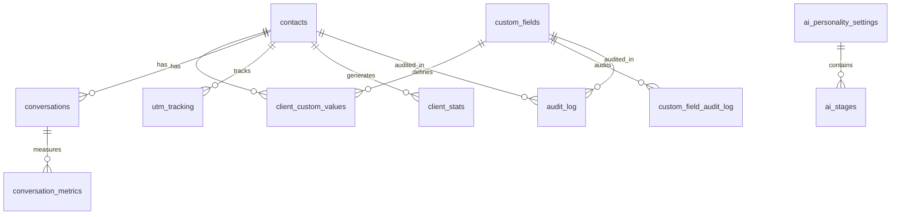

# Documentação Atualizada do Banco de Dados Supabase

## Resumo das Atualizações

Esta documentação foi atualizada após uma inspeção completa do banco de dados Supabase e comparação com os tipos TypeScript. As seguintes melhorias foram implementadas:

### ✅ Tabelas Adicionadas ao types.ts
- `ai_products` - Produtos de IA disponíveis
- `client_stats` - Estatísticas dos clientes
- `conversation_metrics` - Métricas de conversas
- `funnel_data` - Dados do funil de vendas
- `utm_metrics` - Métricas de UTM
- `ai_personality_settings` - Configurações de personalidade da IA
- `ai_stages` - Estágios da IA

### 🔧 Scripts Criados
- `update-types.cjs` - Script para atualizar types.ts com tabelas faltantes
- `add-ai-types.cjs` - Script para adicionar tabelas AI ao types.ts
- `create-ai-tables.cjs` - Script com SQL para criar tabelas AI no Supabase

## Estrutura Completa do Banco de Dados

### Tabelas Principais

#### 1. **contacts** (Contatos/Clientes)
```sql
id: string (PK)
name: string
email: string | null
phone: string | null
client_name: string | null
client_type: string | null
client_size: string | null
kanban_stage: string | null
status: string | null
created_at: timestamp
updated_at: timestamp
-- ... outros campos
```

#### 2. **conversations** (Conversas)
```sql
id: string (PK)
client_id: string (FK -> contacts.id)
status: string
created_at: timestamp
updated_at: timestamp
-- ... outros campos
```

#### 3. **custom_fields** (Campos Customizados)
```sql
id: string (PK)
field_name: string
field_type: string
is_required: boolean
created_at: timestamp
```

#### 4. **client_custom_values** (Valores de Campos Customizados)
```sql
id: string (PK)
client_id: string (FK -> contacts.id)
field_id: string (FK -> custom_fields.id)
field_value: Json
created_at: timestamp
```

### Tabelas de Métricas e Analytics

#### 5. **client_stats** (Estatísticas dos Clientes)
```sql
id: string (PK)
client_id: string (FK -> contacts.id)
total_conversations: number
total_messages: number
avg_response_time: number
last_interaction: timestamp
satisfaction_score: number
created_at: timestamp
updated_at: timestamp
```

#### 6. **conversation_metrics** (Métricas de Conversas)
```sql
id: string (PK)
conversation_id: string (FK -> conversations.id)
message_count: number
duration_minutes: number
sentiment_score: number
resolution_status: string
created_at: timestamp
updated_at: timestamp
```

#### 7. **funnel_data** (Dados do Funil)
```sql
id: string (PK)
stage_name: string
client_count: number
conversion_rate: number
avg_time_in_stage: number
created_at: timestamp
updated_at: timestamp
```

#### 8. **utm_tracking** (Rastreamento UTM)
```sql
id: string (PK)
lead_id: string (FK -> contacts.id)
utm_source: string
utm_medium: string
utm_campaign: string
utm_content: string
utm_term: string
device_type: string
ip_address: inet
user_agent: string
landing_page: string
referrer: string
created_at: timestamp
-- ... outros campos UTM
```

#### 9. **utm_metrics** (Métricas UTM)
```sql
id: string (PK)
utm_source: string
utm_medium: string
utm_campaign: string
total_visits: number
total_conversions: number
conversion_rate: number
total_revenue: number
created_at: timestamp
updated_at: timestamp
```

### Tabelas de IA

#### 10. **ai_products** (Produtos de IA)
```sql
id: string (PK)
name: string
description: string
price: number
category: string
features: Json
is_active: boolean
created_at: timestamp
updated_at: timestamp
```

#### 11. **ai_personality_settings** (Configurações de Personalidade da IA)
```sql
id: string (PK)
name: string
description: string
personality_traits: Json
response_style: string
tone: string
expertise_areas: string[]
is_active: boolean
created_at: timestamp
updated_at: timestamp
```

#### 12. **ai_stages** (Estágios da IA)
```sql
id: string (PK)
name: string
description: string
stage_order: number
personality_id: string (FK -> ai_personality_settings.id)
prompts: Json
conditions: Json
actions: Json
is_active: boolean
created_at: timestamp
updated_at: timestamp
```

### Tabelas de Auditoria

#### 13. **audit_log** (Log de Auditoria)
```sql
id: string (PK)
table_name: string
record_id: string
operation: string (INSERT/UPDATE/DELETE)
old_values: Json
new_values: Json
changed_by: string
changed_at: timestamp
ip_address: inet
user_agent: string
```

#### 14. **custom_field_audit_log** (Log de Auditoria de Campos Customizados)
```sql
id: string (PK)
field_id: string (FK -> custom_fields.id)
client_id: string (FK -> contacts.id)
old_value: Json
new_value: Json
changed_by: string
changed_at: timestamp
```

### Tabelas de Backup

#### 15. **chat_messages_backup** (Backup de Mensagens)
```sql
id: number (PK)
conversation_id: string
phone: string
user_message: string
bot_message: string
message_type: string
data: string
active: boolean
created_at: timestamp
```

#### 16. **chats_backup** (Backup de Chats)
```sql
id: number (PK)
conversation_id: string
phone: string
app: string
created_at: timestamp
updated_at: timestamp
```

### Tabelas de Sistema

#### 17. **tokens** (Tokens)
```sql
id: number (PK)
Input: string
Output: string
PromptTokens: string
CompletionTokens: string
CachedTokens: string
CostUSD: number
Timestamp: timestamp
Workflow: string
```

## Views (Visualizações)

### 1. **dados_cliente** (Dados Completos do Cliente)
View que combina informações de clientes com dados adicionais:
```sql
id: number
client_name: string
email: string
telefone: string
cpf_cnpj: string
client_type: string
client_size: string
kanban_stage: string
payments: Json
created_at: timestamp
-- ... outros campos
```

### 2. **latest_chat_messages** (Últimas Mensagens)
View para acessar as mensagens mais recentes:
```sql
id: number
message: Json
message_time: timestamp
```

### 3. **v_clients_complete** (Clientes Completos)
View com informações completas dos clientes incluindo relacionamentos.

## Funções do Banco de Dados

### 1. **get_utm_metrics**
Função para obter métricas de UTM processadas.

### 2. **update_updated_at_column**
Função trigger para atualizar automaticamente o campo `updated_at`.

### 3. **reorder_ai_stages**
Função para reordenar estágios da IA automaticamente.

## Relacionamentos Principais



## Índices Importantes

- `idx_ai_stages_personality_id` - Performance para consultas de estágios por personalidade
- `idx_ai_stages_order` - Ordenação de estágios
- `idx_ai_personality_active` - Filtro de personalidades ativas
- `idx_ai_stages_active` - Filtro de estágios ativos
- Índices automáticos em chaves estrangeiras

## Políticas de Segurança (RLS)

- Tabela `utm_tracking` possui políticas de Row Level Security ativas
- Outras tabelas podem ter políticas específicas configuradas

## Próximos Passos

1. **Executar SQL no Supabase**: Execute o SQL gerado em `create-ai-tables.cjs` para criar as tabelas `ai_personality_settings` e `ai_stages`
2. **Verificar Hooks**: Confirme que todos os hooks TypeScript estão funcionando com as novas definições
3. **Testar Aplicação**: Execute a aplicação para verificar se os erros 404 foram resolvidos
4. **Implementar Validações**: Adicione validações de dados para os novos campos
5. **Documentar APIs**: Atualize a documentação das APIs que utilizam essas tabelas

## Comandos Úteis

```bash
# Atualizar types.ts com novas tabelas
node update-types.cjs

# Adicionar tabelas AI ao types.ts
node add-ai-types.cjs

# Inspecionar tabelas do banco
node inspect-tables-detailed.js
```

## SQL para Criar Tabelas AI

Para criar as tabelas `ai_personality_settings` e `ai_stages` no Supabase, execute o seguinte SQL:

```sql
-- Criar tabela ai_personality_settings
CREATE TABLE IF NOT EXISTS ai_personality_settings (
  id UUID PRIMARY KEY DEFAULT gen_random_uuid(),
  name VARCHAR(255) NOT NULL,
  description TEXT,
  personality_traits JSONB,
  response_style VARCHAR(100),
  tone VARCHAR(100),
  expertise_areas TEXT[],
  is_active BOOLEAN DEFAULT true,
  created_at TIMESTAMP WITH TIME ZONE DEFAULT NOW(),
  updated_at TIMESTAMP WITH TIME ZONE DEFAULT NOW()
);

-- Criar tabela ai_stages
CREATE TABLE IF NOT EXISTS ai_stages (
  id UUID PRIMARY KEY DEFAULT gen_random_uuid(),
  name VARCHAR(255) NOT NULL,
  description TEXT,
  stage_order INTEGER NOT NULL,
  personality_id UUID REFERENCES ai_personality_settings(id) ON DELETE CASCADE,
  prompts JSONB,
  conditions JSONB,
  actions JSONB,
  is_active BOOLEAN DEFAULT true,
  created_at TIMESTAMP WITH TIME ZONE DEFAULT NOW(),
  updated_at TIMESTAMP WITH TIME ZONE DEFAULT NOW()
);

-- Função para reordenar estágios
CREATE OR REPLACE FUNCTION reorder_ai_stages()
RETURNS TRIGGER AS $$
BEGIN
  -- Reordenar estágios quando um é inserido ou atualizado
  UPDATE ai_stages 
  SET stage_order = stage_order + 1 
  WHERE personality_id = NEW.personality_id 
    AND stage_order >= NEW.stage_order 
    AND id != NEW.id;
  
  RETURN NEW;
END;
$$ LANGUAGE plpgsql;

-- Trigger para updated_at em ai_personality_settings
CREATE OR REPLACE FUNCTION update_updated_at_column()
RETURNS TRIGGER AS $$
BEGIN
  NEW.updated_at = NOW();
  RETURN NEW;
END;
$$ LANGUAGE plpgsql;

CREATE TRIGGER update_ai_personality_settings_updated_at
  BEFORE UPDATE ON ai_personality_settings
  FOR EACH ROW
  EXECUTE FUNCTION update_updated_at_column();

-- Trigger para updated_at em ai_stages
CREATE TRIGGER update_ai_stages_updated_at
  BEFORE UPDATE ON ai_stages
  FOR EACH ROW
  EXECUTE FUNCTION update_updated_at_column();

-- Trigger para reordenar estágios
CREATE TRIGGER reorder_stages_trigger
  BEFORE INSERT OR UPDATE OF stage_order ON ai_stages
  FOR EACH ROW
  EXECUTE FUNCTION reorder_ai_stages();

-- Índices para performance
CREATE INDEX IF NOT EXISTS idx_ai_stages_personality_id ON ai_stages(personality_id);
CREATE INDEX IF NOT EXISTS idx_ai_stages_order ON ai_stages(stage_order);
CREATE INDEX IF NOT EXISTS idx_ai_personality_active ON ai_personality_settings(is_active);
CREATE INDEX IF NOT EXISTS idx_ai_stages_active ON ai_stages(is_active);

-- Inserir dados de exemplo
INSERT INTO ai_personality_settings (name, description, personality_traits, response_style, tone, expertise_areas) VALUES
('Assistente Padrão', 'Personalidade padrão para atendimento geral', 
 '{"empathy": 8, "professionalism": 9, "friendliness": 7, "patience": 9}', 
'helpful', 'professional', 
'{"customer_service", "general_support"}'),

('Vendedor Especialista', 'Personalidade focada em vendas e conversão', 
 '{"persuasion": 9, "enthusiasm": 8, "confidence": 9, "empathy": 7}', 
'persuasive', 'enthusiastic', 
'{"sales", "product_knowledge", "negotiation"}'),

('Suporte Técnico', 'Personalidade para suporte técnico especializado', 
 '{"technical_expertise": 10, "patience": 10, "clarity": 9, "problem_solving": 10}', 
'technical', 'calm', 
'{"technical_support", "troubleshooting", "software"}');

-- Inserir estágios de exemplo
INSERT INTO ai_stages (name, description, stage_order, personality_id, prompts, conditions, actions) 
SELECT 
  'Saudação Inicial', 
  'Primeiro contato com o cliente', 
  1, 
  id, 
  '{"greeting": "Olá! Como posso ajudá-lo hoje?", "introduction": "Sou seu assistente virtual."}',
  '{"triggers": ["new_conversation", "first_message"]}',
  '{"collect_info": true, "set_context": true}'
FROM ai_personality_settings WHERE name = 'Assistente Padrão';

INSERT INTO ai_stages (name, description, stage_order, personality_id, prompts, conditions, actions) 
SELECT 
  'Qualificação', 
  'Entender as necessidades do cliente', 
  2, 
  id, 
  '{"questions": ["Qual é sua principal necessidade?", "Como posso melhor atendê-lo?"]}',
  '{"triggers": ["after_greeting", "need_qualification"]}',
  '{"qualify_lead": true, "gather_requirements": true}'
FROM ai_personality_settings WHERE name = 'Assistente Padrão';
```

---

**Última atualização**: Dezembro 2024
**Versão**: 2.0
**Status**: ✅ Sincronizado com banco de dados